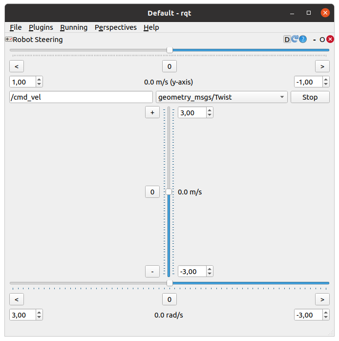
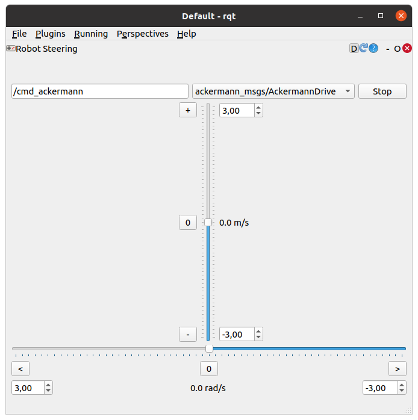

# RQT-Robot-Steering-Plugin

This plugin has been forked from the original [rqt-robot-steering-plugin](https://github.com/ros-visualization/rqt_robot_steering)

It has been changed to switch the output to either a [geometry_msgs/Twist](https://docs.ros.org/en/noetic/api/geometry_msgs/html/msg/Twist.html) with an optional linear-y-velocity:

or an [ackermann_msgs/AckermannDrive](https://docs.ros.org/en/noetic/api/ackermann_msgs/html/msg/AckermannDrive.html):

